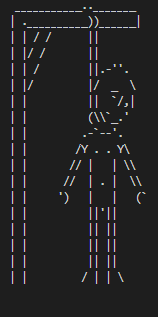
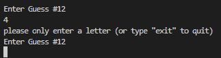
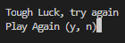
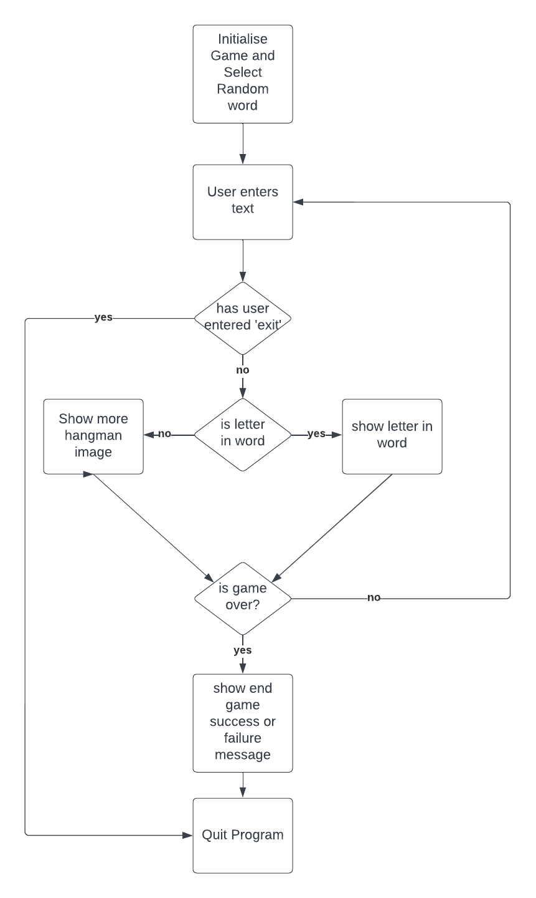
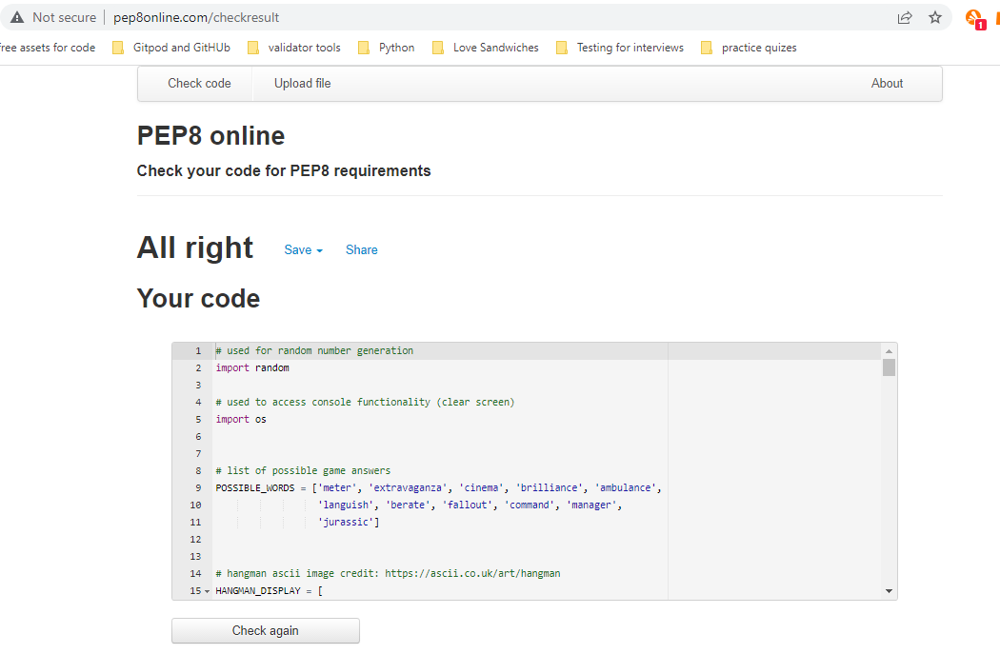

# HANGMAN Game
Hangman is a Python terminal game which runs in the Code Institute mock terminal on Heroku.

Users can try to guess the letters to a randomly selected word from a list of eleven words. A wrong guess generates a section of the hangman. On successful completion of the game, users are notified with a 'Well Done' message. Alternatively on an unsuccessful turn users are notified with a 'Try Again' message.

Try out the game: https://hangman-game-odojoe.herokuapp.com/

# How to play

On starting the game a random word will generate in the form of dashes equal to the word length.

The user will then guess a letter, type the letter into the terminal and hit enter. If the guess is right the letter will occupy its correct position in the word. However, if the guess is wrong a section of the hangman will generate.

The user has seven wrong guesses before the hangman fully generates and ends the game.

The user can select either lowercase or uppercase letters. A selection of a symbol or number will generate the following message: 'please only enter a letter (or type "exit" to quit)'

The user will win the game successfully guessing the word before generting the hangman.

# Features
* Randomly-selected word from a list of eleven words.
* Detailed hangman representation

* The user has the ability to use uppercase or lowercase letters and the game will recognise either the letters correct positioning in the word or a wrong guess 
* If the user selects a character or a number the following message displays: 'please only enter a letter (or type "exit" to quit)'

* User can play the game as often as they wish using the retry option

# Data Model
The game organises data as follows:
1. Python list of possible words
2. Python list of the hangman image
3. Constants are held at a global level
4. All data is passed between functions in-parameters
5. State is maintained by parameters passed between functions

# Testing
The code was manually tested using the following:
* Ran code through PEP 8 online with a positive result and no errors
* Family and friends played the game a number of times and no bugs were discovered
* Tested in the local terminal and the Heroku terminal
* Flow chart tested as follows:

# Bugs
* Case sensitivity of user input issue discovered. I fixed this by using .upper() string function.
* On the play again option a random key must be pressed twice. I can't yet find a solution to this bug therefore I add the following text as a work around: 'double press any key to start'

# Validator Testing
* PEP8 no errors returned from the PEP8online.com validator

# Depolyment
The project was deployed using the Code Institute's mock terminal for Heroku.

- ### <u>Steps for Deployment:</u>
1. Fork or Clone this repository
2. Create a new Heroku App
3. Add the buildbacks to Python and Nodejs in that order
4. Link the Heroku App to the repository (using 'heroku git:remote -a hangman-game-odojoe')
5. Deploy from github to Heroku (using 'git push heroku main')

# Credits
* Hangman ascii image credit: https://ascii.co.uk/art/hangman
* Import OS from https://www.geeksforgeeks.org/clear-screen-python/ to clear the console screen
* Code Institute Python Module content
* W3 Schools for the Learn Python and Python Tutorials section
* PEP8online.com
* Gitpod, GitHUb and Heroku
* Lucid Chart
* My mentor for his invaluable advice